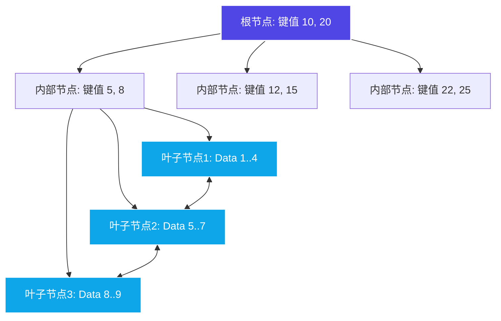
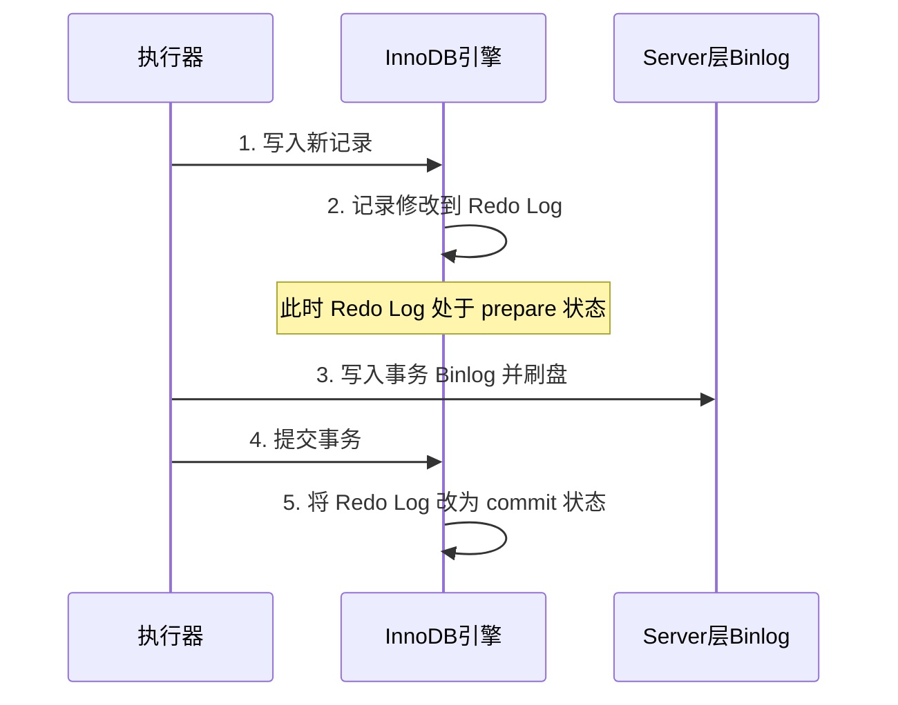

# MySQL 核心原理

本篇详细解析 MySQL 数据库的核心机制与底层原理，以最常用的 **InnoDB** 存储引擎为主进行分析。

---

## 1. InnoDB 索引原理

索引是快速检索数据的数据结构。InnoDB 引擎默认且最核心的索引实现方式是 **B+ 树**。

### 1.1 B+ 树索引结构
B+ 树是在 B 树（Balanced Tree）基础上演进的平衡多路查找树：
- **非叶子节点只存储键值和指针**，不存储实际的数据行。这使得每个节点可以容纳更多的键，从而拥有极大的分叉数（Fan-out），降低树的高度（通常 3 到 4 层即可支撑千万级数据）。
- **所有实际数据行全部存储在叶子节点**。
- **叶子节点之间通过双向链表相连**，提供了极其高效的范围查询和顺序扫描能力。

### 1.2 聚簇索引 vs 非聚簇索引
- **聚簇索引（Clustered Index）**：索引结构与数据行物理存储在一起。InnoDB 的主键索引即为聚簇索引，叶子节点直接存储整行记录。
- **二级索引（Secondary Index / 辅助索引）**：非主键列创建的索引。叶子节点存储的是该列的值以及**主键值**。当通过二级索引查询非主键列且未命中覆盖索引时，需要通过主键值回到聚簇索引中再次检索，这称为 **回表（Lookup）**。

---

## 2. 事务机制与 MVCC 原理

事务是逻辑上的一组操作，InnoDB 支持完整的 **ACID** 特性，其隔离级别主要基于 **MVCC（多版本并发控制）** 来实现。

### 2.1 事务的 ACID 特性与实现
*   **原子性 (Atomicity)**：由 **Undo Log（回滚日志）** 保证。事务失败时通过 Undo Log 撤销已执行的 SQL。
*   **一致性 (Consistency)**：事务的最终目的，由其他三个特性以及业务层面的约束共同保证。
*   **隔离性 (Isolation)**：由 **锁机制** 与 **MVCC** 共同保证。
*   **持久性 (Durability)**：由 **Redo Log（重做日志）** 保证。防止数据库宕机导致内存未刷盘数据丢失。

### 2.2 MVCC（多版本并发控制）
MVCC 用于在 **读已提交（Read Committed, RC）** 和 **可重复读（Repeatable Read, RR）** 隔离级别下，实现无锁的“一致性非锁定读”。

MVCC 的底层实现依赖于：
1.  **行记录隐式字段**：
    - `DB_TRX_ID`：最近修改该行记录的事务 ID。
    - `DB_ROLL_PTR`：回滚指针，指向该行上一个版本的 Undo Log 记录。
2.  **Undo Log 版本链**：每次修改记录时，旧版本数据都会写入 Undo Log，并通过 `DB_ROLL_PTR` 连接成一条链表。
3.  **Read View（一致性视图）**：当事务进行快照读时，会生成一个 Read View，用于判断当前事务能看到版本链中的哪个版本。
    - **RC 级别**：每次 `SELECT` 都会生成一个新的 Read View。
    - **RR 级别**：仅在事务中第一次 `SELECT` 时生成 Read View，后续查询复用该视图，从而保证可重复读。

---

## 3. InnoDB 日志系统

MySQL 数据持久化与高可用依赖于三大日志：**Redo Log**、**Undo Log** 和 **Binlog**。

| 日志类型 | 归属层级 | 写入方式 | 物理/逻辑 | 核心作用 |
| :--- | :--- | :--- | :--- | :--- |
| **Redo Log** | InnoDB 存储引擎 | 循环写（大小固定） | 物理日志（记录数据页的物理修改） | 保证事务持久性，崩溃恢复（Crash-Safe） |
| **Undo Log** | InnoDB 存储引擎 | 追加写 | 逻辑日志（记录相反的 SQL 操作） | 保证事务原子性，提供 MVCC 多版本读 |
| **Binlog** | MySQL Server 层 | 追加写（滚动新建） | 逻辑日志（记录原始 SQL 或行变更） | 主从复制与任意时间点数据恢复（PITR） |

### 3.1 两阶段提交（Two-Phase Commit, 2PC）
为了保证 Redo Log 和 Binlog 在事务提交时的一致性，MySQL 采用**两阶段提交**机制：

如果在步骤 3 写入 Binlog 之前系统崩溃，重启恢复时发现 Redo Log 处于 prepare 状态且没有对应的 Binlog，事务会被回滚；如果 Binlog 已经写入成功，则会提交事务，从而保障了主从库数据的一致。
