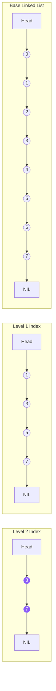

# Redis 缓存技术

Redis 是一个高性能的开源内存键值存储系统，广泛用于缓存、会话管理和实时数据处理。

---

## 1. 核心数据结构与底层实现

Redis 的每种基本数据类型底层通常会根据数据规模和类型选用不同的数据结构，以最大化利用内存并保持高效性能。

| 基础数据类型 | 常用底层数据结构 |
| :--- | :--- |
| **String（字符串）** | **SDS (简单动态字符串)**（具备常数复杂度获取长度、防缓冲区溢出、空间预分配） |
| **List（列表）** | **Quicklist (双向列表 + Listpack)**（兼顾了链表插入效率和压缩列表的内存紧凑性） |
| **Hash（哈希）** | **Listpack** (旧版本为 Ziplist) 或 **Hashtable (渐进式 rehash)** |
| **Set（集合）** | **Intset (整数集合)** 或 **Hashtable** |
| **ZSet（有序集合）** | **Listpack** 或 **Skiplist (跳表) + Hashtable** |

### 1.1 跳表（Skiplist）结构
跳表是有序集合（ZSet）的底层数据结构之一。它在普通单向链表之上增加了多层索引，使得查询、插入和删除的平均复杂度达到 $O(\log n)$。

---

## 2. 单线程与高并发模型

虽然 Redis 6.0 引入了多线程来处理网络 I/O 读写，但其**核心命令执行依然是单线程的**。

### 2.1 为什么单线程还能这么快？
1.  **纯内存操作**：所有读写完全在内存中完成，CPU 不是 Redis 的瓶颈。
2.  **非阻塞 I/O 多路复用**：基于 **Reactor 模式**。利用 Linux 系统的 `epoll`，Redis 可以单线程处理数万个并发的网络连接，避免了多线程上下文切换和锁竞争的开销。
3.  **合理高效的数据结构**：精心设计的底层结构（SDS、跳表等）能够极大降低指令时间复杂度。

---

## 3. 常见缓存问题与解决方案

在高并发高负载架构下，使用 Redis 缓存经常需要面对以下三个经典问题：

### 3.1 缓存穿透 (Penetration)
*   **现象**：客户端查询的数据**在数据库和缓存中都不存在**。导致每次请求都直接穿透缓存落到数据库，可能导致数据库崩溃。
*   **解决方案**：
    1.  **缓存空值/默认值**：如果查询为空，在 Redis 写入一个空值（TTL 设置较短，如 5 分钟），防止高并发穿透。
    2.  **布隆过滤器 (Bloom Filter)**：将所有可能存在的数据 Hash 映射到 Bloom 数组中。请求到达缓存前先通过 Bloom 过滤器判定，若过滤器说不存在，直接返回。

### 3.2 缓存击穿 (Breakdown)
*   **现象**：某个**热点 Key** 在过期的一瞬间，有海量并发请求同时涌入，由于缓存未命中，全部请求瞬间打到数据库上。
*   **解决方案**：
    1.  **热点数据不设过期时间**：通过后台线程异步更新缓存。
    2.  **互斥锁 (Mutex Lock)**：在缓存失效时，使用 `SETNX` 获取分布式锁，只有获取到锁的线程才能去查询数据库并写回缓存，其他请求等待重试。

### 3.3 缓存雪崩 (Avalanche)
*   **现象**：在极短的时间内，**大量缓存 Key 集中过期**，或者 **Redis 服务集群发生宕机**。导致所有请求全部落到数据库。
*   **解决方案**：
    1.  **随机化过期时间 (Jitter)**：设置缓存过期时间时，在基础 TTL 上加上一个随机时间偏差（例如 1-5 分钟），避免 Key 同时到期。
    2.  **构建高可用 Redis 集群**：主从复制 + 哨兵，或部署 Redis Cluster 架构。
    3.  **多级缓存**：结合本地缓存（如 Caffeine/Guava）。

---

## 4. Redis Cluster 集群架构

为了解决单机内存上限和写入瓶颈，Redis 引入了分布式集群方案。

### 4.1 哈希槽分片 (Hash Slot)
Redis Cluster 采用**虚拟哈希槽**机制：
- 整个集群共有 **16384** 个哈希槽（Slots）。
- 每个节点负责托管一部分哈希槽。例如有 3 个 Master 节点：
  - Node A: `0 - 5460`
  - Node B: `5461 - 10922`
  - Node C: `10923 - 16383`
- 当客户端读写某个 Key 时，通过公式 $Slot = CRC16(Key) \pmod{16384}$ 计算出对应的槽位，然后将请求路由至该槽位所在的物理节点。
- 集群节点间使用 **Gossip 协议** 交换节点状态和拓扑信息。
